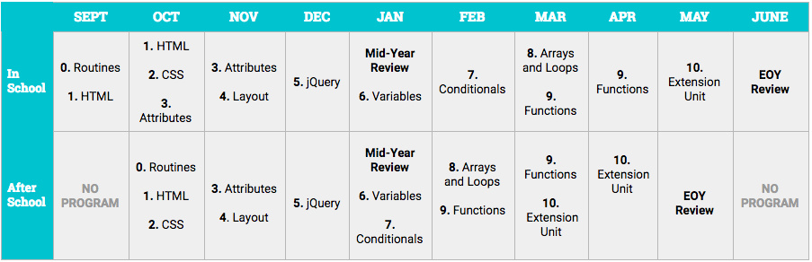

Foundations Curriculum, 18-19
===================

<!--
Pacing Calendar (Year 1)
===================
|  Sept | Oct | Nov | Dec | Jan | Feb | March | April | May |
|:--------|:---|:---|:---|:---|:---|:---|:---|:---|:---|
|  [**0:Welcome**](units/unit0)   1: HTML   **Survey**|  2:CSS   3:HTML    4:Positioning  | 5:jQuery  6:Cloud9  7:Github | 6:Cloud9   7:Github  | 8:JavaScript   9:Types, Conditionals |  9: Types, Conditionals  10:Functions  | 11:Arrays  12:Animations | 12:Animations  13:Looping| 14:Capstone   Survey |
-->
## Pacing Calendar

## Scope and Sequence

| Unit | Overview | Objectives   *Coders will...*| 
|:--------|:---:|:---------|
| [**0: Routines**](units/unit0) | 3 lessons| <ul> <li> Identify two things they are excited to learn in ScriptEd and be able to name their classmates and teachers.</li> <li> Navigate the Popcode coding environment. </li> <li> Navigate Google Classroom, create a Github account to share their work, and complete the intake form. </li> </ul>|
| [**1: HTML**](units/unit1) | 5 lessons  |<ul> <li> Use correct syntax to create an an opening and a closing HTML tag.</li> <li> Use correct syntax to create simple HTML elements. </li> <li> Nest HTML elements including ordered and unordered lists. </li></li> <li> Create HTML elements with attributes to add links to their pages. </li><li> Create HTML elements with attributes to add images to their pages. </li></ul>|
| [**2: CSS**](units/unit2) | 3 lessons   1 project  |<ul> <li> Select an HTML element and change its style using CSS.</li> <li> Style a page using CSS properties and values. </li> <li> Describe the difference between 'head' and 'body' by linking Google Fonts to style their page. </li> <li> Use CSS properties and values, and Google Fonts to style a professional website for a friend. </li> </ul>|
| [**3: HTML Attributes**](units/unit3) | 2 lessons   1 project  |<ul> <li> Use class selectors to style specific groups of elements on the page.</li> <li> Use class attributes to organize related groups of elements to be styled with CSS. </li> <li> Use class selectors and class attributes to style an awards website. </li></ul> |
| [**4: Flexbox, Wireframing, Positioning, Layout**](units/unit4) | 4 lessons   1 project |<ul> <li> Use box model (padding, border, and margin) to manipulate the spacing of elements on a page. </li> <li> Organize their HTML using DIVs. </li><li> Use flexbox to align elements on a webpage. </li> <li> Use flexbox to create columns on a webpage. </li><li> Use their wireframing, box model, and flexbox skills to complete a website for a VIP client. </li></ul>|
| [**5: jQuery**](units/unit5) | 4 lessons  2 projects|<ul> <li> Use jQuery to select, show, and hide HTML elements. </li><li> Use jQuery actions to make HTML elements toggle, slide, and fade. </li> <li> Build a “spellbook” webpage that uses 3 or more jQuery actions to manipulate an element on the page. </li><li> Use jQuery actions that take one or more arguments, including .text(), and .css(), when a button is clicked. </li><li> Write event handlers that allow the page to respond when a user interacts with it. </li><li> Use jQuery actions to build an interactive treasure hunt website. </li></ul>|
| [**Mid-Year Review Unit**](units/midyear) | 2 lessons|<ul><li> Review key HTML, CSS, and jQuery concepts. </li> <li> Demonstrate their HTML, CSS, and JQuery knowledge through the Mid-Year Challenge. </li> </ul> |
| [**6: Variables, Value Types, Operators, input.val**](units/unit6) | 3 lessons   1 project  |<ul> <li> Create a new variable, store information in it, and read its value. </li><li> Identify strings and numbers as value types and differentiate between them. </li><li> Use input.val( ) to retrieve a value from an input field. </li><li> Use variables and operators to create a website that predicts the future. </li> </ul>|
| [**7: Conditionals**](units/unit7) | 3 lessons   1 project |<ul> <li> Create basic conditional statements.</li> <li> Create conditional statements with multiple conditions using else-if. </li> <li>Identify, evaluate and construct compound conditional statements.</li><li>Use conditional statements to create a character quiz.	</li> </ul>|
| [**8: Arrays and Loops**](units/unit8) | 3 lessons   1 project  | <ul> <li> Create an array and retrieve an array element using the index. </li> <li> Create forEach loops in JavaScript in order to iterate over an array. </li> <li> Add elements to an array by using .push() and get the number of elements in the array by using .length. </li> <li> Iterate over the items in an array using a for loop. </li> <li>Use arrays and loops to build a photo gallery of rival things.</li> </ul>|
| [**9: Functions**](units/unit9) |3 lessons   1 project  | <ul> <li> Use functions to break long sections of code into smaller, easier to understand pieces.</li><li> Write function declarations to improve code organization.</li><li> Use functions to reduce duplications in code.</li></ul>|
| [**End-of-Year Wrap Up**](units/EOY_Review_Unit) | 3 lessons |<ul> <li> Review key concepts learned over the course of the year.</li> <li> Demonstrate their HTML, CSS, and JQuery knowledge through an End-of-Year Challenge. </li><li> Complete an end-of-year survey to reflect on their ScriptEd experience and share feedback. </li> </ul>|
| [**Extension Unit: Animations and Collisions**](units/extensions) | 4 lessons   1 project  |<ul> <li> Explain the structure of an HTML webpage.</li> <li> Create a webpage that contains a head and a body. </li> </ul>|
----

<h3 align="center"><a href="https://docs.google.com/forms/d/e/1FAIpQLSeLpI-m6UKvIxk97F8R1iidFRaYXJ3dfcUuIjx2Pz0WMfO1SA/viewform">Submit Your Feedback</a> || <a href="https://github.com/ScriptEdcurriculum/curriculum18-19/wiki">Check Out the Wiki</a> </h3>

----
## School Teacher Resources

* [ScriptEd Teacher Liaison Curriculum Guide 18-19](https://docs.google.com/document/d/1IisBQOGlbDj1QBxcGtKrL-E5gZXhoUiumWlvkNHz8yg/edit): To be used in ScriptEd course that are co-taught with a teacher from the school.

----

**Curriculum content contributed by**: Dan Applegate, Matthew Brown, Vanessa Dean, Meghan Knoll, Sophat Sam, Scot Spinner, Tanya Trinkle, Jesse Wang, and Sarah Zinger

For more information about ScriptEd, please visit us at [scripted.org](https://www.scripted.org). 
 
ScriptEd Curriculum is licensed under a <a rel="license" href="http://creativecommons.org/licenses/by-nc/4.0/">Creative Commons Attribution-NonCommercial 4.0 International License</a>. 

