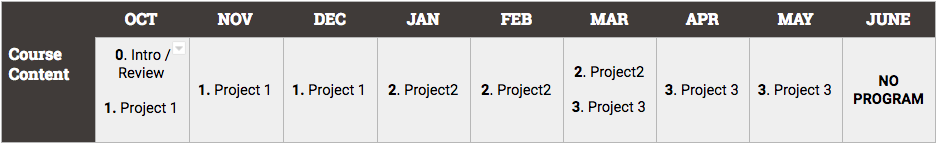

# Studio Curriculum, 18-19

## Pacing Guide

## Scope and Sequence

| Unit  | Sessions | Overview|
|:-------|:-------:|------|
| [**0: Welcome**](units/unit0) | 1 | In this unit, coders will get to know their company, their instructors and their classmates.    Coders will review important routines, procedures and documents. Coders will complete a beginning of year challenge to review HTML, CSS, and Javascript from the Foundations and Advanced courses.|
| [**1: Project1**](units/unit) | 9 | This unit is currently under construction. Please check back soon for updates.|
| [**2: Project2**](units/unit) | 9 | This unit is currently under construction. Please check back soon for updates.|
| [**3: Project3**](units/unit) | 9 | This unit is currently under construction. Please check back soon for updates.|

----
<h3 align="center"><a href="https://docs.google.com/forms/d/e/1FAIpQLSeLpI-m6UKvIxk97F8R1iidFRaYXJ3dfcUuIjx2Pz0WMfO1SA/viewform">Submit Your Feedback</a> || <a href="https://github.com/ScriptEdcurriculum/curriculum18-19/wiki">Check Out the Wiki</a> </h3>

----
**Curriculum content contributed by**: 

For more information about ScriptEd, please visit us at [scripted.org](https://www.scripted.org). 
 
ScriptEd Curriculum is licensed under a <a rel="license" href="http://creativecommons.org/licenses/by-nc/4.0/">Creative Commons Attribution-NonCommercial 4.0 International License</a>. 

