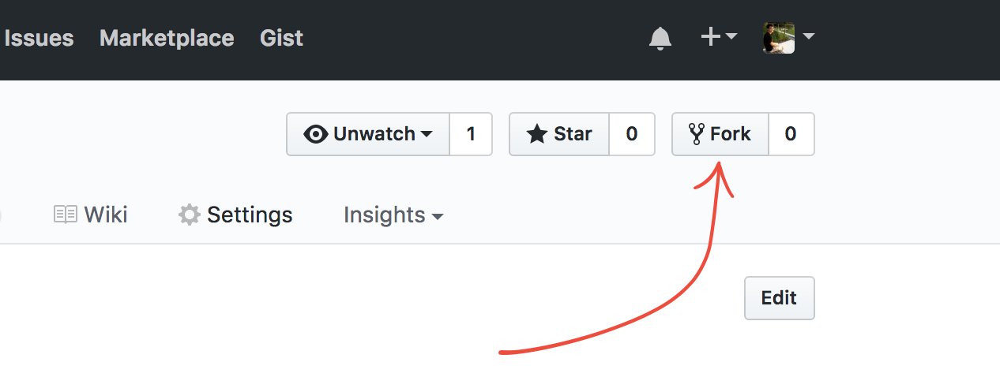
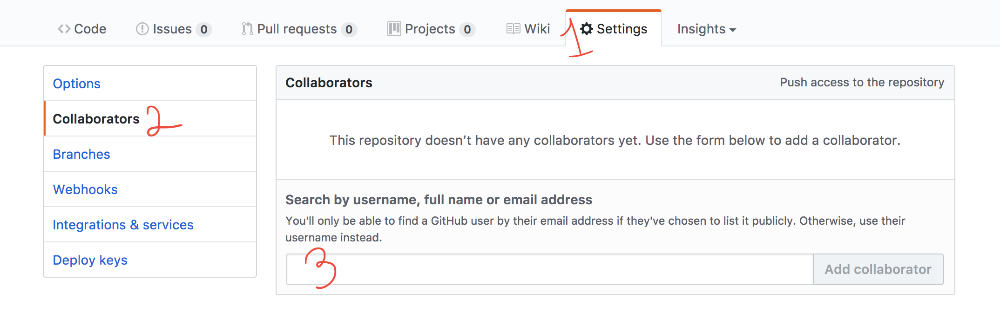

# Studio Scavenger Hunt
A scavenger hunt to start off a new year of ScriptEd Studio

- [Overview](#overview)
- [Setup](#project-setup)
- [Scavenger Hunt!](#scavenger-hunt)

## Overview
Students will pair up to complete the challenges below that will test their
skills on topics covered in previous years of ScriptEd years.

## Project Setup

1. Fork this repo so you have your own repo to save your work.

   
   
1. Add your partner as a collaborator to your repo so you can both make commits
   and work in parallel.

   

1. Complete the challenges!
1. After completing a challenge or section commit and push your changes to your
   repo to save your work.

   _Forget how to do that? No worries! Take a few minutes to go through this
   tutorial [try.github.io] Also check out this [GitHub cheat sheet]._

1. If you want to keep track of your progress change the `[ ]` to `[x]` in your
   `README.md` file to check off the checkboxes:
   - [x] Challenge complete!

## Scavenger Hunt!

### HTML

- [ ] `1pt` Create an `index.html` file in your fork of this repo and add the
  following html to it:
- [ ] `1pt` The title of the page should be "ScriptEd Scavengers!"
- [ ] `1pt` There should be a header on the page that contains the text "Hello
  Studio!"
- [ ] `1pt` There should be a smaller header on the page that contains you and your
  partner's names.
- [ ] `1pt` Add a paragraph element with a paragraph of text from <lipsum.com>.

### CSS

- [ ] `1pt` Create an `index.css` file.
- [ ] `1pt` Link the css file from the html file.
- [ ] `5pt` The headers on the page should be centered, but not the other text on the
  page.
- [ ] `1pt` The headers should be in a [sans serif font] and the rest of the text
  should be a [serif font].
- [ ] `1pt` The page should have a [taupe] background.
- [ ] `10pt` Using CSS animate the header text to slowly change font color.

### JavaScript & jQuery

- [ ] `1pt` Create an `index.js` file.
- [ ] `1pt` Import your js file from your html file.
- [ ] `1pt` Import a jQuery library from you html file. _Note your `index.js` file
  will use jQuery so import order matters._

#### Objects & Variables

- [ ] `1pt` Create a variable `num` set to a random integer between 1 and 100.
- [ ] `1pt` Create a string `now` set to the current time and date.
- [ ] `3pt` Create an array `names` set to strings of the first names of all of
  the students in the class.
- [ ] `5pt` Create an object `teachers` mapping all of the teachers' first names
  to an array of their last names.

#### Functions

- [ ] `1pt` Create a function `log` that takes a single argument and logs it
  using [`console.log`].
- [ ] `1pt` Create a function `randInt` that takes two arguments: a min and a
  max and returns an integer between them.
- [ ] `10pt` Create a function `numberWords` that take a number and returns a
  string of that number represented in english words.

#### Conditionals and Loops

- [ ] `1pt` Call the function `log` on each name in the array `names`.
- [ ] `1pt` If the length of `names` is odd `log` `"The students are kind of
  odd."` Otherwise `log` `"The class is very even."`
- [ ] `1pt` Log random numbers between 1 and 100 until you get one that is a
  multiple of 7.

#### jQuery

- [ ] `2pt` Create a `<ul>` on the page with `<li>` elements containing each
  name in `names`.
- [ ] `2pt` Create a second `<ul>` on the page with `<li>` elements containing
  of the first names in `teachers`.
- [ ] `3pt` When any of the teachers' `<li>` elements are clicked on [`alert`]
  the last names associated with the first name in the `teachers` object.
- [ ] `5pt` Instead of using `alert` for the previous challenge have the last
  names displayed temporarily alongside the first name.
- [ ] `7pt` A few seconds after having been clicked remove the last names from
  the `<li>` to reset to only the first name.

#### APIs and AJAX

- [ ] `1pt` Use [`$.ajax`] to call
  `https://storage.googleapis.com/studio/hello.json` and `log` the response.
- [ ] `2pt` Get `http://ip.jsontest.com/?callback=showMyIP` and show the
  returned IP address on your page.
- [ ] `5pt` Use the [public Giphy API key] to request an image and display
  anywhere on your page.
- [ ] `11pt` Add a map to the bottom of your page that shows the user's current
  location using the [Google Maps API].

### GitHub

- [ ] `1pt` When finished with all the above challenges, commit and push all of
  your changes, and send a [pull request] to the repo that you originally
  forked.

[try.github.io]: https://try.github.io
[GitHub cheat sheet]: https://education.github.com/git-cheat-sheet-education.pdf
[sans serif font]: https://en.wikipedia.org/wiki/sans-serif
[serif font]: https://en.wikipedia.org/wiki/serif
[taupe]: https://en.wikipedia.org/wiki/taupe
[pull request]: https://help.github.com/articles/creating-a-pull-request/
[`console.log`]: https://developer.mozilla.org/en-US/docs/Web/API/Console/log
[`alert`]: https://developer.mozilla.org/en-US/docs/Web/API/Window/alert
[`$.ajax`]: http://api.jquery.com/jquery.ajax/
[public Giphy API key]: https://giphy.api-docs.io/1.0/welcome
[Google Maps API]: https://developers.google.com/maps/documentation/javascript/geolocation
